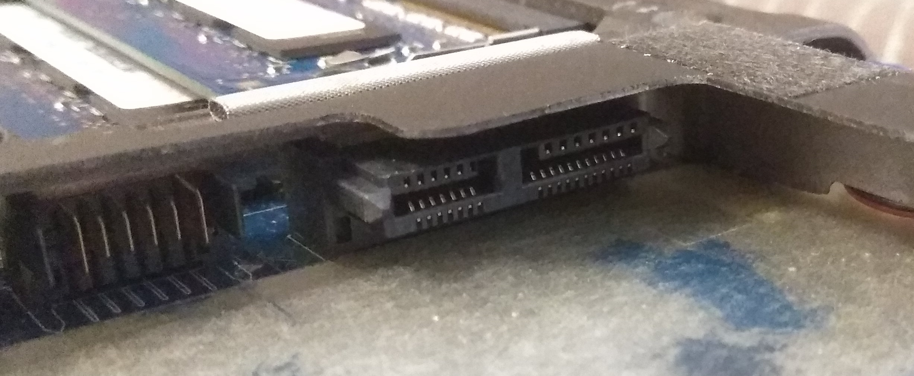
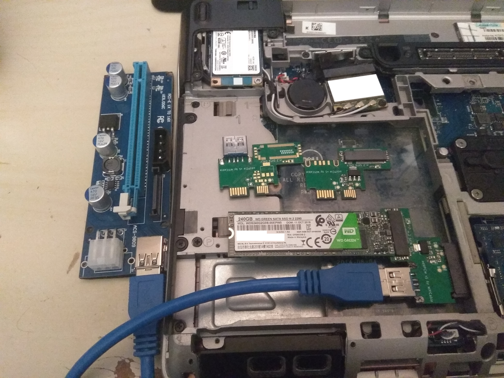
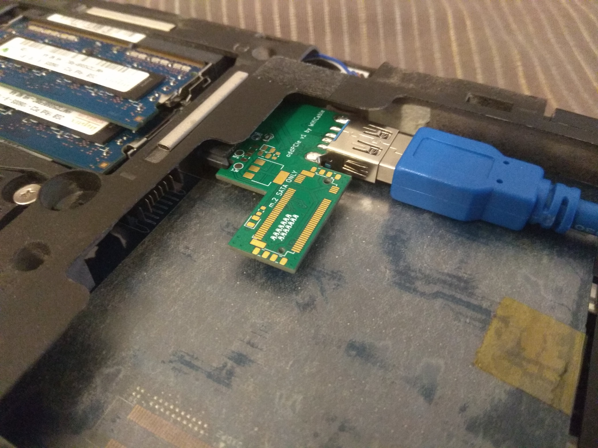
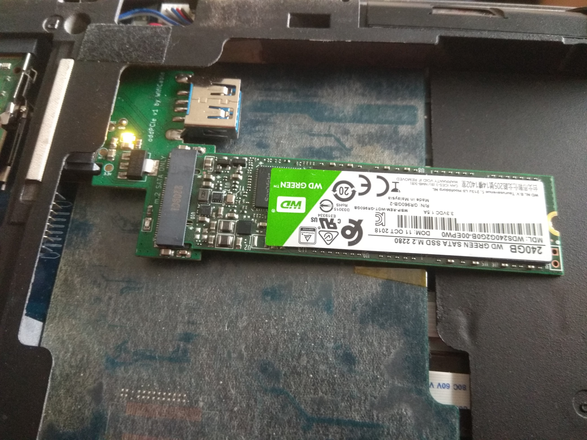
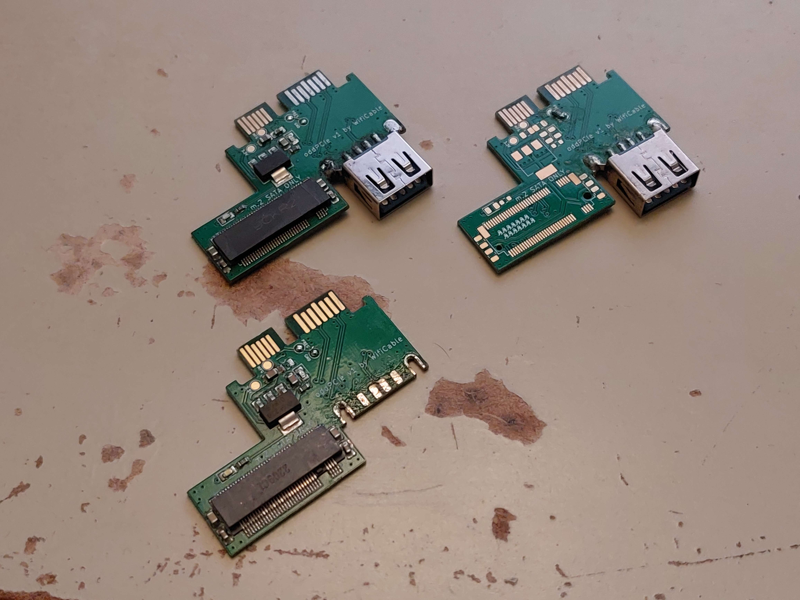
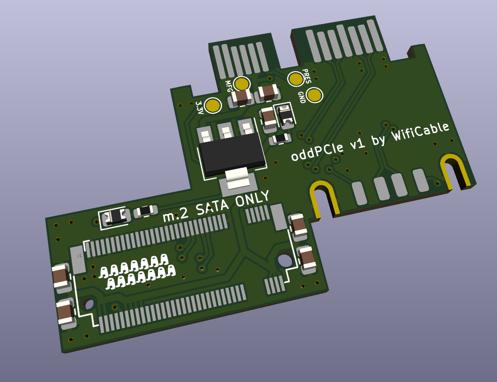
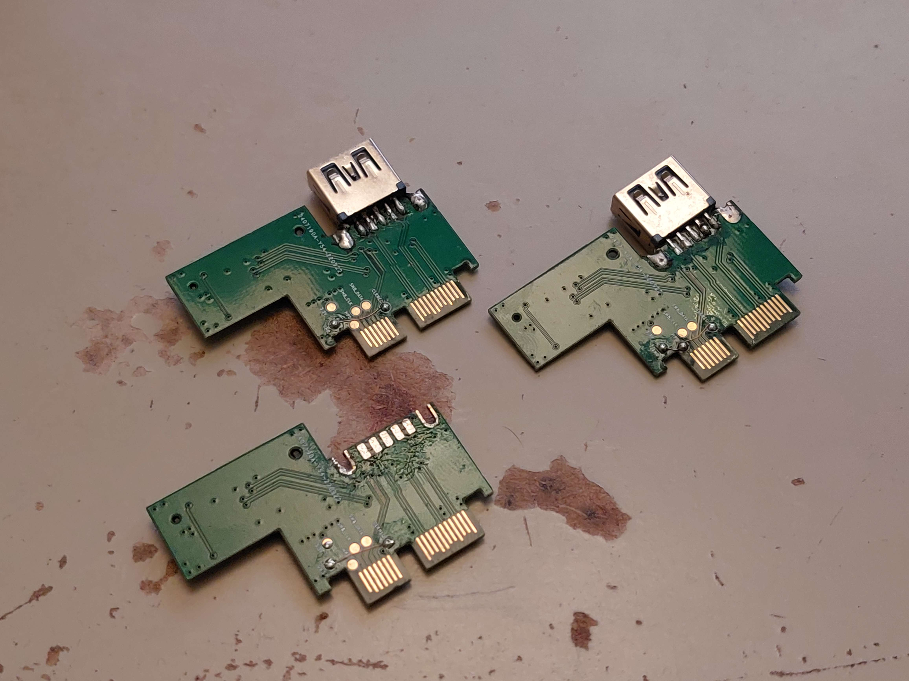
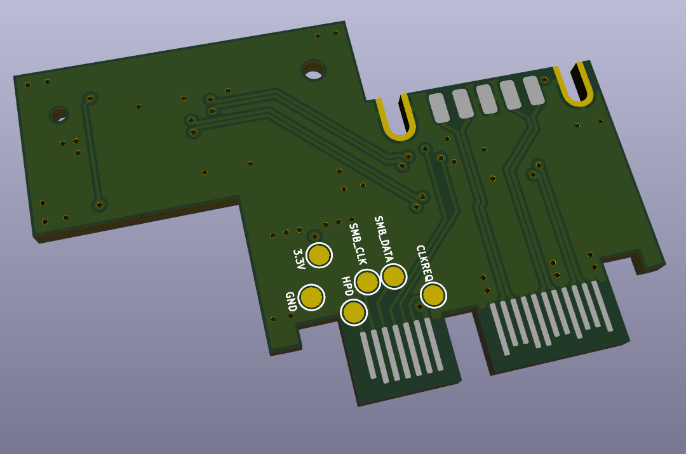
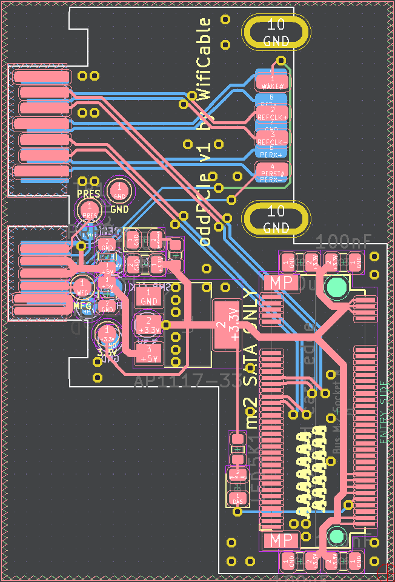

# oddPCIe
PCIe + M.2 SATA breakout for Dell Latitude laptop optical drive modular bay

The optical drive (odd) SATA ports on a number of Dell Latitude laptops from 2011-2013 have a PCIe x1 lane hidden in them, meant for use with the AE3USB01 USB 3.0 expansion module:  

> 

> Optical bay port in an E6420, note the second row of pins

## Laptops featuring this port:
* E6320
* E6330 / E6430s
* E6420
* E6430
* E6440
* E6520
* E6530
* E6540 / M2800

Note: The E6440, E6540 and M2800 don't seem to support hot-plug on this PCIe port, as they never actually shipped with anything using this port (the AE3USB01's bezel doesn't even line up with the case)  

## Features:

* PCIe x1 on a USB 3.0 type-a plug compatible with common mining risers
* M.2 SATA SSD slot, since the SATA port is there anyway
* Testpoints for misc pins on the connector

> 
> 

> oddPCIe plugged in to 2 different laptops, showing the fit

> 

> 3.3V regulator power led lighting up

**This board has been manufactured and tested working**  
PCIe port only active if CLKREQ pad is connected to ground  
SATA power only active if PRES pad is connected to ground

